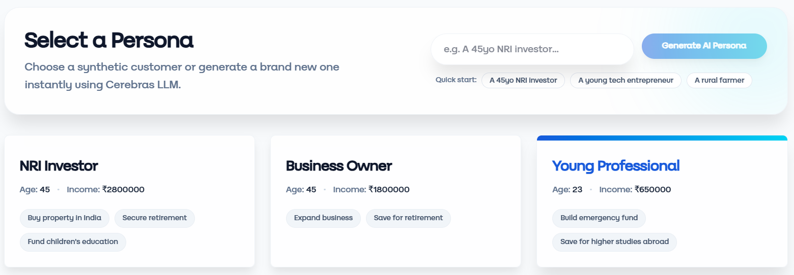
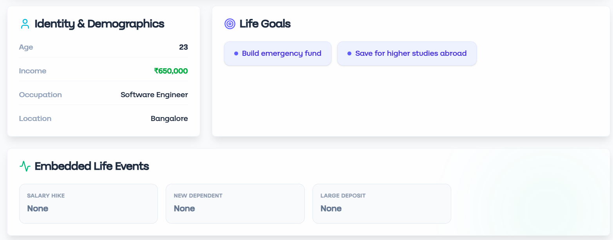
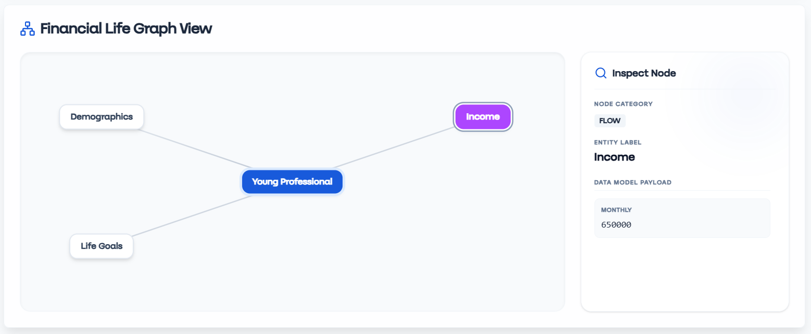
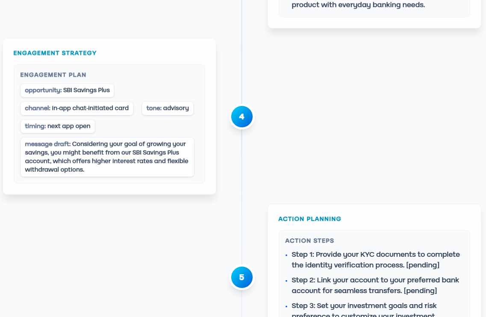
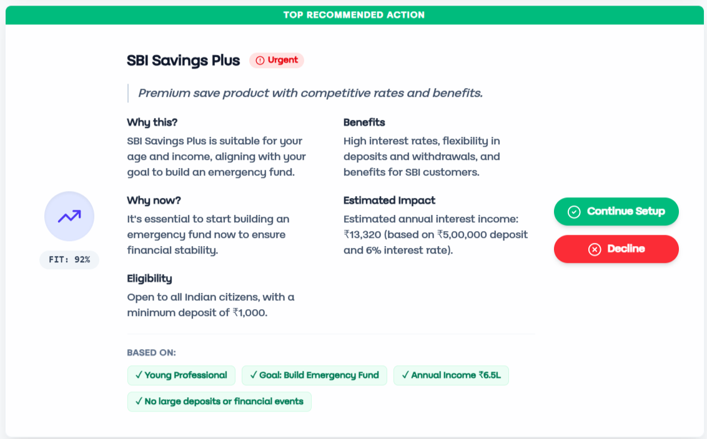
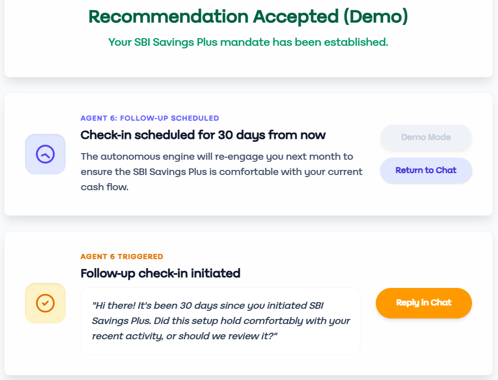
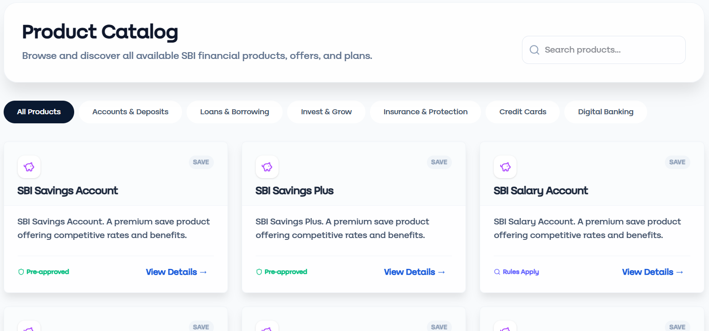
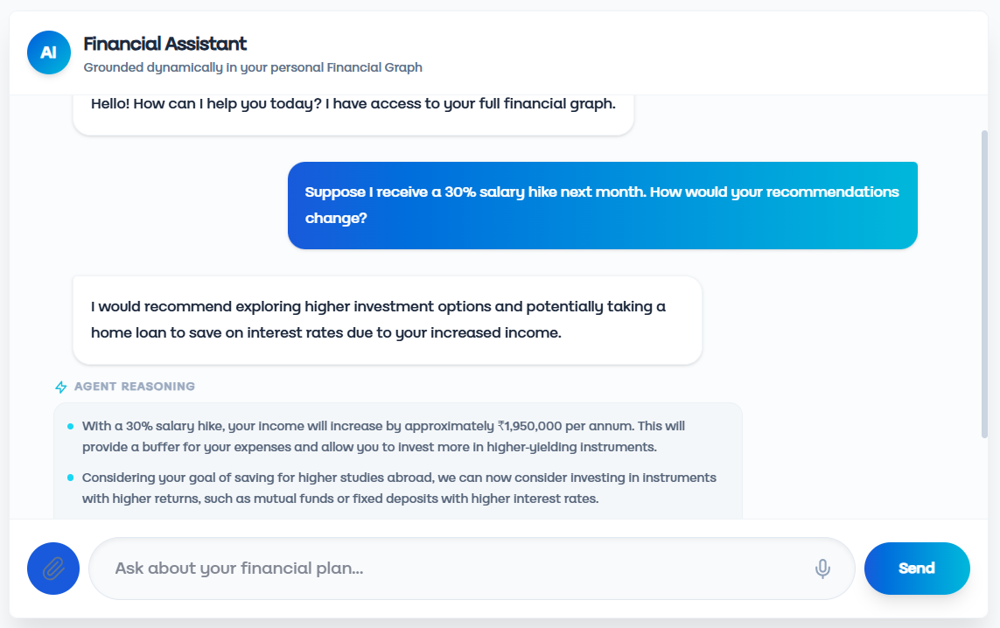
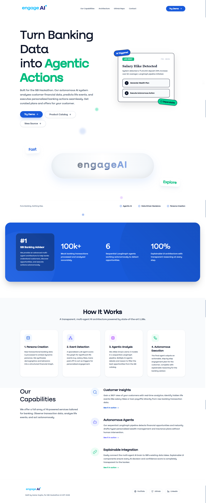
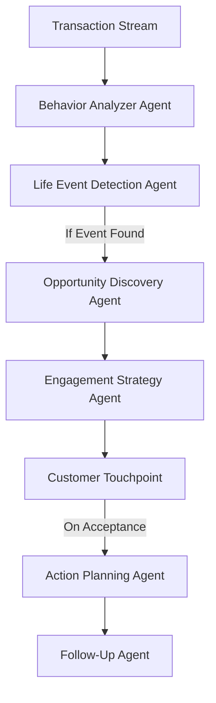

  

# 🏦 engageAI - Your Financial Copilot
**Built by Aarav Gupta for the SBI Hackathon @ GFF 2026**
*Theme: Agentic AI & Emerging Tech | Problem Statement: Digital Engagement*

  
  
  
  
  

🔗 **[Try the Live Demo Here!](https://sbiengageai.netlify.app/)**

---

## 🚀 The Vision: Shifting Banking from Reactive to Proactive
Banking today is fundamentally reactive. Customers look at their accounts, determine their own needs, and initiate transactions. 

**engageAI** flips this model entirely. It is an autonomous, multi-agent AI layer that continuously analyzes customer financial behavior, detects life events as they happen, and proactively engages customers with reasoned, relevant recommendations. We turn every customer interaction from a request-response transaction into an ongoing, advisory relationship.

---

## 📱 Platform Interface

Here is a glimpse of the powerful interfaces provided by engageAI, showcasing transparent reasoning and autonomous action pipelines:

  
  
  
  
  
  
  
  
  

---

## 🧠 The Architecture: 6 Autonomous Agents

A six-agent LangGraph system operates on a continuously evolving Financial Life Graph per customer. The system detects events such as salary hikes, marriage, child birth, relocation, and home-purchase intent from transaction patterns.

A **FastAPI backend** orchestrates this six-node LangGraph against a **PostgreSQL-backed** Financial Life Graph. The **React frontend** streams live agent reasoning via **Server-Sent Events** into a dedicated Agent Activity Center, making the system’s reasoning auditable and highly explainable.

---

## 📈 Commercial Potential & Business Impact

Revenue is generated indirectly through:
- **Increased Cross-Sell Conversion**: Highly targeted, contextual product recommendations.
- **CLV Uplift**: Higher Customer Lifetime Value on SBI’s existing product catalog.
- **Cost Reduction**: Secondary value comes from reduced call-center and branch load for routine advisory queries.
- **Internal Utilization**: The Synthetic Customer Generator can be used independently for QA and staff training.

---

## 🛠️ Technology Stack

- **Frontend:** React + TypeScript + Tailwind CSS (Component-driven architecture)
- **Backend:** FastAPI (Python) with Server-Sent Events (SSE) for live streaming
- **Orchestration:** LangGraph (Six-node sequential agent graph)
- **LLM Provider:** Groq / Gemini (used for rapid reasoning, synthetic generation, and contextual chat)
- **Database:** PostgreSQL (Customer graph stored as JSONB, transactions, audit trails)
- **Deployment:** Netlify (Frontend) / Render (Backend)

---

## ⚙️ Running Locally

### Backend Setup
1. `cd backend`
2. `python -m venv venv`
3. `venv\Scripts\activate`
4. `pip install -r requirements.txt`
5. Create a `.env` file referencing `.env.example` (Add your Groq API key).
6. `uvicorn main:app --reload`

### Frontend Setup
1. `cd frontend`
2. `npm install`
3. Create a `.env` file with `VITE_API_URL=http://localhost:8000`
4. `npm run dev`

---
*Built with ❤️ for the State Bank of India.*