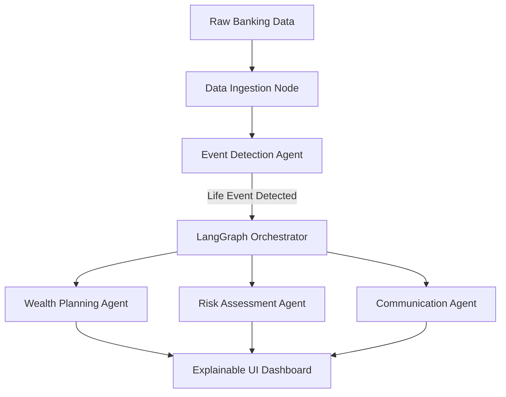

# 🏦 engageAI

<div align="center">
  
</div>

<p align="center">
  <strong>Built by Aarav Gupta, for SBI Hackathon @ GFF 2026</strong><br>
  <em>Turn Raw Banking Data into Agentic Actions</em>
</p>

<p align="center">
  
  
  
  
  
</p>

## 🚀 Overview

**engageAI** is an advanced multi-agent architecture designed to help banks understand customers, discover hidden financial opportunities, and execute autonomous actions seamlessly.

By monitoring raw banking transactions, engageAI detects critical life events (such as sudden salary hikes or large loan payoffs). Once detected, a LangGraph orchestration pipeline of 6 specialized AI agents springs into action, instantly generating hyper-personalized wealth management plans and executing autonomous CRM actions—all while providing a 100% transparent, explainable UI for bank administrators.

## 🎯 Key Features

- **Customer Insights Analytics:** 360° view of customer data with real-time life event detection.
- **Autonomous Agents:** A sequential LangGraph pipeline that drafts financial plans without human intervention.
- **Explainable Architecture:** Every agent's reasoning, context, and confidence score is fully visible in the UI.
- **Cerebras Powered:** Utilizing 120B parameter models for ultra-rapid, human-like reasoning.

## 🧩 Architecture



## 💻 Local Setup & Development

1. **Clone the repository:**
   ```bash
   git clone https://github.com/aaravgupta0202/engageAI.git
   ```
2. **Navigate to frontend:**
   ```bash
   cd engageAI/frontend
   ```
3. **Install dependencies:**
   ```bash
   npm install
   ```
4. **Run development server:**
   ```bash
   npm run dev
   ```

## 📜 Hackathon Details

- **Event:** SBI Agentic AI Hackathon
- **Author:** [Aarav Gupta](https://github.com/aaravgupta0202)
- **Portfolio:** [https://aarav-cc.netlify.app/](https://aarav-cc.netlify.app/)

<details>
<summary><b>Code of Conduct</b></summary>
This project adheres to the standard hackathon Code of Conduct. By participating, you are expected to uphold these standards.
</details>

<details>
<summary><b>Certificate of Authenticity</b></summary>
We certify that all code written for engageAI during the hackathon timeframe is original, aside from standard open-source libraries and frameworks explicitly mentioned in `package.json`.
</details>

---

<p align="center">Made with ❤️ for SBI Hackathon</p>